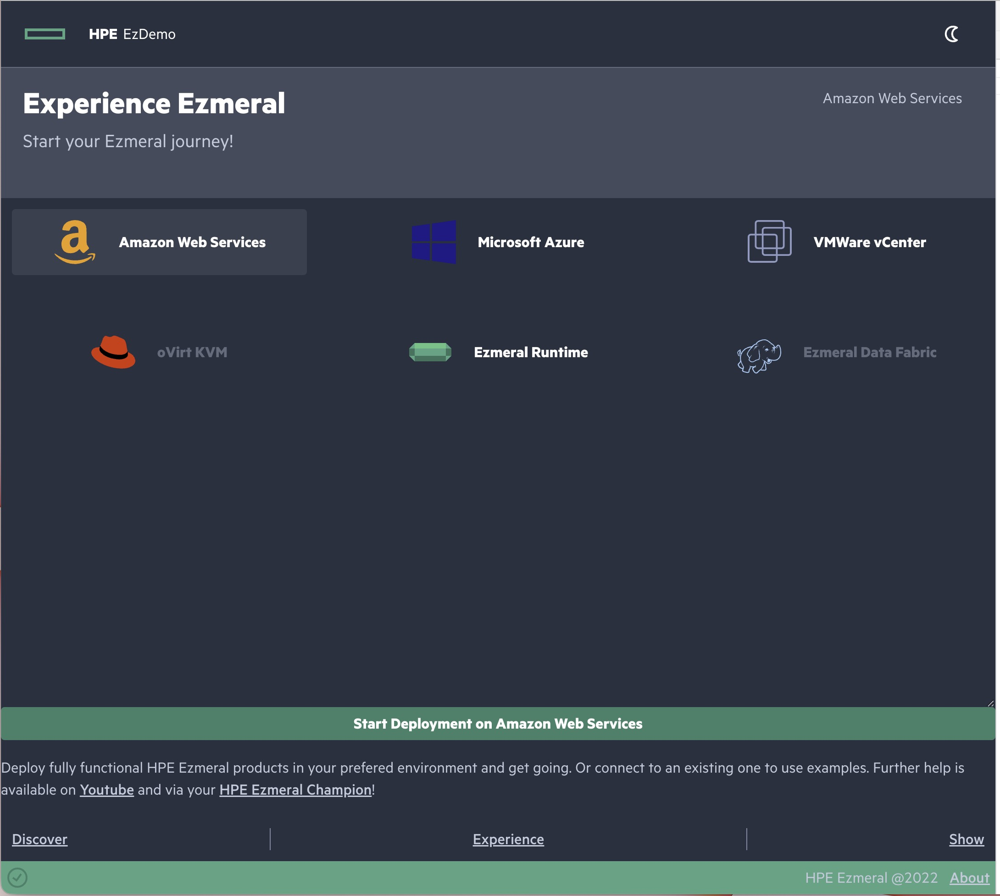
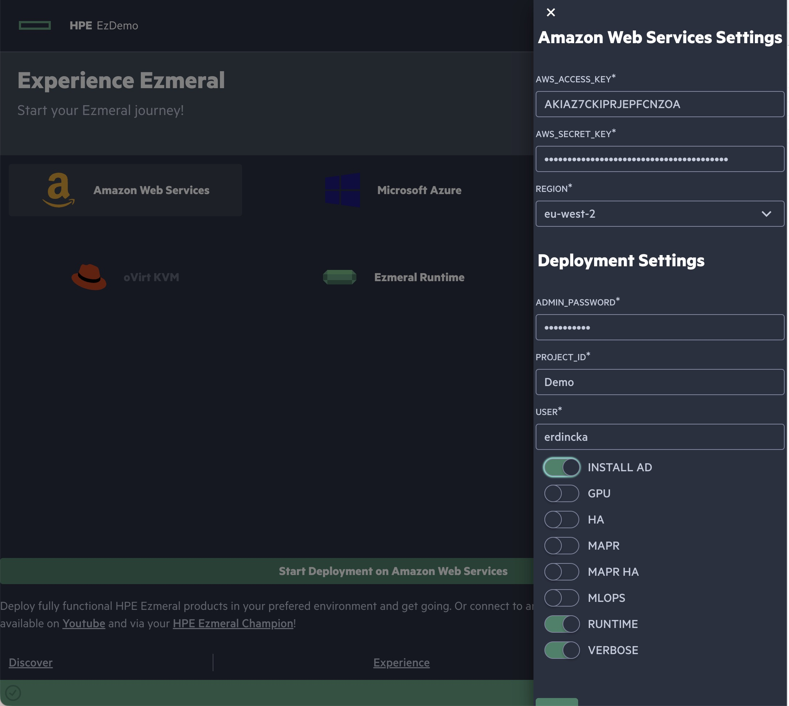
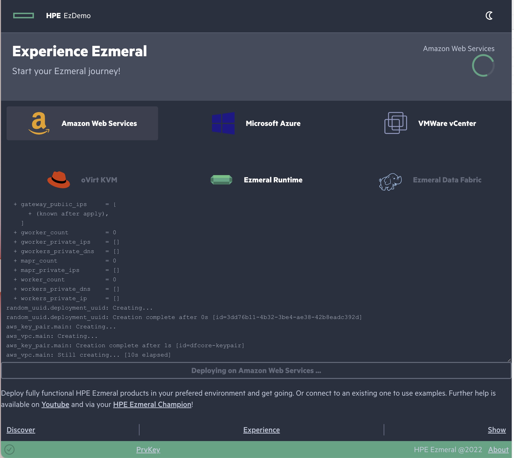

# Ezmeral Container Platform Demo

Automated installation for Ezmeral Container Platform and MLOps on various platforms for demo purposes.

You need a container runtime to run the tool. It should work on any container runtime and tested on Docker. Podman doesn't work if you try to map volumes (should work fine without the mounts).

## Recognition

This tool is possible because of the amazing work by;

- Chris Snow (<https://github.com/snowch>)

  and

- Dirk Derichsweiler (<https://github.com/dderichswei>)

## Usage

It is recommended to use a workspace (folder) to keep your settings, instead of editing settings files in the container. You need to create a user.settings and credentials file (as explained below).

Create a file named "user.settings" as following:

```json
{
  "project_id": "",
  "user": "",
  "admin_password": "ChangeMe.",
  "is_mlops": false,
  "is_mapr": false,
  "is_mapr_ha": true,
  "is_gpu": false,
  "is_ha": false,
  "is_runtime": true,
  "is_verbose": true,
  "install_ad": true,
  "extra_tags": {}
}
```

Create "aws_config.json", "azure_config.json", or "dc.ini" file in the same folder. Use one of the following templates:

AWS Template:

```json
{
  "aws_access_key": "",
  "aws_secret_key": "",
  "region": ""
}
```

Azure Template:

```json
{
  "az_subscription": "",
  "az_appId": "",
  "az_password": "",
  "az_tenant": "",
  "region": ""
}
```

Data Center Template:

```ini
[DEFAULT]
### Data Center Settings
dc=name_of_dc # used for specific settings
vm_network=10.1.1.192/24 # IP allocation will start with the given IP in that subnet, controller the first (or three if HA etc)
### VMWARE SETTINGS
vcenter_server=
vcenter_user=
vcenter_password=
vcenter_datacenter_name=
vcenter_cluster_name=
vcenter_template_name=            # CentOS/RHEL 7.x template with min 400GB OS disk
vcenter_template_user=            # user with paswordless sudo configured
vcenter_template_keyfile=         # SSH private key for the centos tempalte user
vcenter_mapr_template_name=       # Changed to Rocky 8.5 (requires perl and cloud-init installed) / Ubuntu 20.04 template with min 100GB OS disk
vcenter_mapr_template_user=       # user with paswordless sudo configured
vcenter_mapr_template_keyfile=      # SSH private key for the ubuntu template user
vcenter_folder=
vcenter_datastore=
vcenter_vswitch=
vm_gateway=
vm_dns=
vm_domain=

```

More details and customization for on premise deployment is documented in [DC Readme file](./server/dc/README.md).

You will need to copy the private key file(s) required by the templates into the container, set its permissions to 0600 (`chmod 0600 prv.key`) and provide the full path inside the container.

Download the [start script](https://raw.githubusercontent.com/HewlettPackard/ezdemo/main/start.sh), or copy/paste below to start the container.

```bash
#!/usr/bin/env bash
VOLUMES=()
CONFIG_FILES=("aws_config.json" "azure_config.json")
for file in "${CONFIG_FILES[@]}"
do
  target="${file%_*}"
  [[ -f "./${file}" ]] && VOLUMES+=("$(pwd)/${file}:/app/server/${target}/config.json:rw")
done

[[ -f "./dc.ini" ]] && VOLUMES+=("$(pwd)/dc.ini:/app/server/${target}/dc.ini:rw")
[[ -f "./user.settings" ]] && VOLUMES+=("$(pwd)/user.settings:/app/server/user.settings:rw")

printf -v joined ' -v %s' "${VOLUMES[@]}"

docker run --name ezdemo --pull always -d -p 4000:4000 -p 8443:8443 -p 9443:9443 ${joined} erdincka/ezdemo:latest
```

Once the container starts, you can either use the WebUI on <http://localhost:4000/> or run scripts manually within the container.

## Web Interface

Select your target


Settings


Start and Monitor Deployment


## Advanced Usage

Exec into the container either by using [exec scripts](https://raw.githubusercontent.com/HewlettPackard/ezdemo/main/docker-exec.sh) or the following command:

```bash
docker exec -it "$(docker ps -f "status=running" -f "ancestor=erdincka/ezdemo" -q)" /bin/bash
```

### Run all at once

`./00-run_all.sh aws|azure|dc`

### Or run in stages

Process is divided into steps to provide granularity.

Step 1 (Init): Prepare the environment (ensure that the required settings are in place, utilities are configured etc).

Step 2 (Apply): To deploy the infrastructure nodes based on the selection (runtime, mlops, mapr etc)

Step 3 (Install): Platform installation based on the selection (AD server, runtime platform, Data Fabric nodes etc).

Step 4 (Configure): Further configuration of the platform(s) for selected options, such as;

- Runtime (is_runtime=true in user.settings file): creates a Kubernetes cluster with an example tenant enabling Spark operator

- MLOps (is_mlops=true in user.settings file): creates a Kubernetes cluster with Data Fabric on Kubernetes as Tenant Storage and configures end to end model serving scenario, such as deployment and configuration of Kubeflow, MLflow, Livy, Spark Operator and a Notebook (includes project repository for CI/CD, training cluster etc)

- Data Fabric (is_mapr=true in user.settings file): creates a standalone Data Fabric cluster (single node if is_mapr=false, 5 nodes if is_mapr=true) and configures it with AD authentication, Spark, Airflow and Hive.

At any stage if script fails or if you wish to update the environment, you can restart the process for a specific step;

- `./01-init.sh aws|azure|dc`
- `./02-apply.sh aws|azure|dc`
- `./03-install.sh aws|azure|dc`
- `./04-configure.sh aws|azure|dc`

Deployed resources will be available in /app/server/ansible/inventory.ini file.

- All access to the public cloud environment is possible only through the gateway host.

- Use `ssh centos@10.1.0.xx` to access hosts within the container, using their internal IP address (~/.ssh/config file is already set up for jump host via gateway)

- You can copy "./generated/controller.prv_key" and "~/.ssh/config" to your workstation to access the deployed nodes directly

- You can access created Kubernetes cluster with kubectl as K8s Admin context is already configured for ~/.kube/config (and you can copy that file from container to your workstation to connect to the K8s cluster directly)

- Copy and install "./generated/\*/minica.pem" into your browser to prevent SSL certificate errors

## Reference

### Utilities used in the container

- AWS CLI - Download from [AWS](https://docs.aws.amazon.com/cli/latest/userguide/getting-started-install.html)
- Azure-CLI - Download from [Azure](https://docs.microsoft.com/en-us/cli/azure/install-azure-cli)
- Terraform - Download from [Terraform](https://www.terraform.io/downloads.html)
- Ansible - Install from [Ansible](https://docs.ansible.com/ansible/latest/installation_guide/intro_installation.html) or simply via pip (sudo pip3 install ansible)
- python3 (apt/yum/brew install python3)
- jq (apt/yum/brew install jq)
- hpecp (pip3 install hpecp)
- kubectl from [K8s](https://kubernetes.io/docs/tasks/tools/install-kubectl-linux/)
- minica (apt/yum/brew install minica)

### Scripts

Following scripts are mainly used to automate the whole process of creating the resources via Terraform (Thanks to Mr Snow) and then trigger the Ansible Playbooks (Thanks to Mr Derichsweiler).

- 00-run_all.sh: Runs all scripts at once (unattended install)

- 01-init.sh: Initialize Terraform, create SSH keys & certificates

- 02-apply.sh: Runs `terraform apply` to deploy resources

- 03-install.sh: Run Ansible scripts to install ECP

- 04-configure.sh: Run Ansible scripts to configure ECP for demo

- 99-destroy.sh: Destroy all created resources (**DANGER**: All resources will be destroyed, except the generated keys and certificates)

### Ansible Scripts

Ansible is used extensively to set up and configure the resources that are deployed via Terraform.

- prepare_centos: Updates packages and requirements for ECP installation

- install_falco: Updates kernel and install falco service

- install_ecp: Initial installation and setup for ECP

- import_hosts: Collects node information and update them as ECP worker nodes

- create_k8s: Installs Kubernetes Cluster (if MLOps is not selected)

- create_picasso: Installs Kubernetes Cluster and Picasso (Data Fabric on Kubernetes)

- configure_picasso: Enables Picasso (Data Fabric on Kubernetes) for all tenants

- configure_mlops: Configures MLOps tenant and life-cycle tools (Kubeflow, Minio, Jupyter NB etc)

- and many more...

## Notes

Deployment defaults to EU-WEST-2 (EU - London) region on AWS, UK South (EU - London) region on Azure.

Please use following format to choose your region on AWS (config.json);

```shell
"us-east-1"      // N.Virginia
"us-east-2"      // Ohio
"us-west-1"      // N.California
"us-west-2"      // Oregon
"ap-southeast-1" // Singapore
"eu-central-1"   // Frankfurt
"eu-west-1"      // Ireland
"eu-west-2"      // London
"eu-west-3"      // Paris
"eu-north-1"     // Stockholm
"ca-central-1"   // Montréal, Québec
```

This format should be used to select a region on Azure;

```shell
"eastus"
"eastus2"
"centralus"
"westus"
"westus2"
"canadacentral"
"canadaeast"
"northeurope"
"westeurope"
"ukwest"
"uksouth"
"francecentral"
"germanynorth"
"centralindia"
"japaneast"
"australiacentral"
"uaenorth"
"southafricawest"
```

\*\* Not all regions are tested, please provide feedback if you have an issue with a region.
